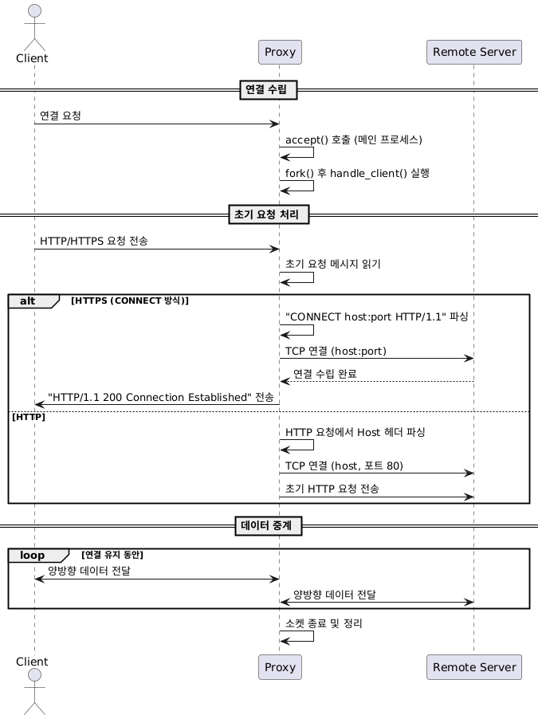
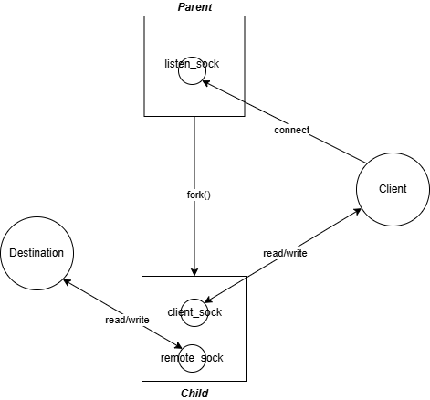

# Multi-process HTTP/HTTPS Proxy Server

이 프로젝트는 멀티 프로세스 구조를 사용하여 HTTP와 HTTPS(Connect 방식) 요청을 모두 처리할 수 있는 프록시 서버입니다.

## 특징

- **HTTP/HTTPS 지원**: 
  - HTTP 요청은 원격 서버로 직접 전달
  - HTTPS 요청은 CONNECT 방식을 통해 터널링 지원
- **멀티 프로세스 구조**: 
  - `fork()`를 이용해 각 클라이언트 연결을 독립적인 프로세스로 처리
- **커맨드라인 인자**:
  - 실행 시 포트 번호를 매개변수로 받아 설정할 수 있음 (기본 포트: 8888)

## 파일 구성

- `sample_proxy.c` 또는 단일 파일로 구현된 프록시 서버 소스 코드
- `README.md`: 이 파일

## 빌드 및 실행

1. **빌드**  
   ```bash
   gcc -o proxy main.c
   ```
   
2. **실행**  
   기본 포트(8888)로 실행:
   ```bash
   ./proxy
   ```
   또는 포트를 지정하여 실행:
   ```bash
   ./proxy 8080
   ```

## 다이어그램

### 시퀀스 다이어그램



### 멀티 프로세스 구조


